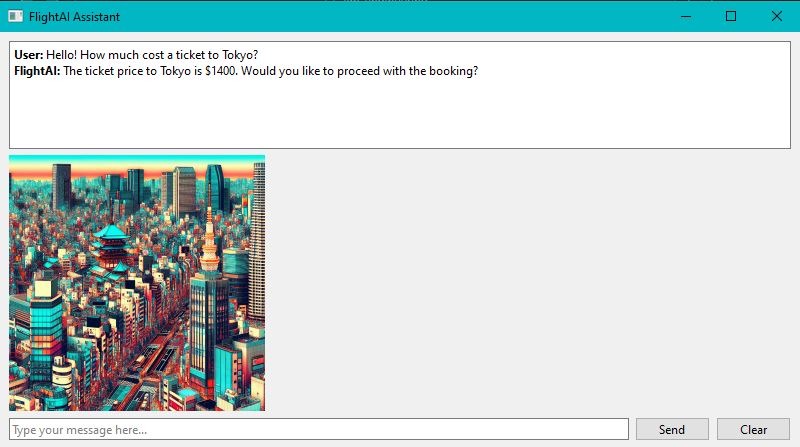

# ✈️ FlightAI Assistant: Multimodal Travel Agent





Un asistente virtual de escritorio para aerolíneas que lleva la experiencia del usuario al siguiente nivel mediante IA Multimodal. No solo responde preguntas sobre vuelos, sino que **genera imágenes** del destino para inspirar al viajero y **responde con voz** para una interacción más natural.

---

## 🌟 Características Principales

* **💬 Chat Inteligente (GPT-4o):** Responde consultas sobre precios de boletos y destinos con contexto de negocio simulado (precios predefinidos para Londres, París, Tokio, Berlín).
* **🎨 Generación de Imágenes (DALL-E 3):** Si el usuario menciona una ciudad, el sistema genera automáticamente una imagen estilo "Pop-Art" del destino para mejorar la experiencia visual.
* **🗣️ Respuesta de Voz (TTS-1):** Convierte la respuesta textual del asistente en audio de alta calidad, reproduciéndolo en tiempo real.
* **🖥️ Interfaz Nativa:** Construida con **PyQt6**, ofreciendo una experiencia de escritorio fluida con visualización de historial e imágenes integradas.

---

## 🛠️ Instalación y Configuración

1.  **Clonar el repositorio:**
    ```bash
    git clone [https://github.com/raulcamaracarreon/FlightAI-Assistant-Desktop.git](https://github.com/raulcamaracarreon/FlightAI-Assistant-Desktop.git)
    cd FlightAI-Assistant-Desktop
    ```

2.  **Crear entorno virtual e instalar dependencias:**
    ```bash
    python -m venv venv
    # Activar entorno (Windows: venv\Scripts\activate | Mac/Linux: source venv/bin/activate)
    pip install -r requirements.txt
    ```

3.  **Configurar API Key:**
    * Crea un archivo `.env` en la raíz del proyecto.
    * Agrega tu clave de OpenAI:
        ```env
        OPENAI_API_KEY=sk-tu-clave-aqui
        ```

4.  **Ejecutar la aplicación:**
    ```bash
    python flight_assistant.py
    ```

---

## 💡 Cómo Usarlo

1.  Escribe por ejemplo **"How much is a ticket to Tokyo?"** en el campo de texto.
2.  **Observa:** El chat te dará el precio ($1400).
3.  **Escucha:** La app leerá la respuesta en voz alta.
4.  **Disfruta:** DALL-E 3 generará una imagen vibrante de Tokio en el panel lateral.

---

## 🧠 Arquitectura del Sistema

La aplicación orquesta tres modelos de OpenAI en un solo flujo:

1.  **Entrada:** Texto del usuario (PyQt6).
2.  **Lógica:**
    * Detecta ciudades clave en el texto.
    * Consulta la base de datos simulada (`ticket_prices`).
3.  **Generación:**
    * **Texto:** GPT-4o-mini genera la respuesta amable.
    * **Imagen:** DALL-E 3 crea el visual del destino.
    * **Audio:** TTS-1 sintetiza la voz del asistente.
4.  **Salida:** La GUI se actualiza asíncronamente con los tres elementos.

---

> **Autor:** Raúl Héctor Cámara Carreón
>
> *Proyecto de integración Multimodal con OpenAI API y Python.*
